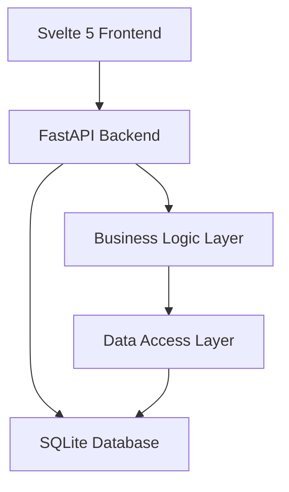

# Design Document

## Overview

The car booking system is a full-stack web application consisting of a Svelte 5 frontend, FastAPI backend, and SQLite database. The system follows a clean architecture pattern with clear separation between presentation, business logic, and data layers. The frontend provides an intuitive booking interface while the backend handles business rules, availability calculations, and data persistence.

## Architecture

### System Architecture


### Technology Stack
- **Frontend**: Svelte 5 with TypeScript for type safety
- **Backend**: FastAPI with Python 3.9+
- **Database**: SQLite for simplicity and portability
- **API Communication**: RESTful APIs with JSON payloads
- **Validation**: Pydantic models for request/response validation

## Components and Interfaces

### Frontend Components

#### BookingForm Component
- Main landing page component
- Handles user input for all booking fields
- Manages form validation and submission
- Displays success/error messages

#### VehicleSelector Component
- Dropdown component for vehicle selection
- Fetches and displays available vehicles
- Shows vehicle details (registration, make, color)

#### DateTimePicker Component
- Date and time selection with validation
- Duration selector with preset options
- Automatic return date calculation display

### Backend API Endpoints

#### Vehicle Management
```
GET /api/vehicles
- Returns list of all vehicles with basic info
- Response: List[VehicleInfo]

GET /api/vehicles/available
- Query params: start_date, end_date
- Returns vehicles available for specified period
- Response: List[AvailableVehicle]
```

#### Booking Management
```
POST /api/bookings
- Creates new booking request
- Request: BookingRequest
- Response: BookingConfirmation

GET /api/bookings/{booking_id}
- Retrieves booking details
- Response: BookingDetails
```

### Data Models

#### Vehicle Model
```python
class Vehicle:
    id: int
    registration: str
    make: str
    color: str
    created_at: datetime
    updated_at: datetime
```

#### Booking Model
```python
class Booking:
    id: int
    vehicle_id: int
    start_datetime: datetime
    end_datetime: datetime
    return_datetime: datetime
    reason: str
    estimated_mileage: int
    status: BookingStatus
    created_at: datetime
```

#### Availability Model
```python
class VehicleAvailability:
    id: int
    vehicle_id: int
    start_date: date
    end_date: date
    is_available: bool
```

## Data Models

### Database Schema

#### vehicles table
- id (INTEGER PRIMARY KEY)
- registration (TEXT UNIQUE NOT NULL)
- make (TEXT NOT NULL)
- color (TEXT NOT NULL)
- created_at (TIMESTAMP DEFAULT CURRENT_TIMESTAMP)
- updated_at (TIMESTAMP DEFAULT CURRENT_TIMESTAMP)

#### bookings table
- id (INTEGER PRIMARY KEY)
- vehicle_id (INTEGER FOREIGN KEY)
- start_datetime (TIMESTAMP NOT NULL)
- end_datetime (TIMESTAMP NOT NULL)
- return_datetime (TIMESTAMP NOT NULL)
- reason (TEXT NOT NULL)
- estimated_mileage (INTEGER NOT NULL)
- status (TEXT DEFAULT 'confirmed')
- created_at (TIMESTAMP DEFAULT CURRENT_TIMESTAMP)

#### vehicle_availability table
- id (INTEGER PRIMARY KEY)
- vehicle_id (INTEGER FOREIGN KEY)
- start_date (DATE NOT NULL)
- end_date (DATE NOT NULL)
- is_available (BOOLEAN DEFAULT TRUE)

### Business Rules Implementation

#### Return Date Calculation
- If end date falls on Friday: return_date = next Monday 9:00 AM
- If end date falls on Saturday/Sunday: return_date = next Monday 9:00 AM
- Otherwise: return_date = end_datetime

#### Availability Logic
- Check for overlapping bookings in the requested time period
- Cross-reference with vehicle_availability seed data
- Only show vehicles available for the entire requested duration

## Error Handling

### Frontend Error Handling
- Form validation errors displayed inline
- Network errors shown as toast notifications
- Loading states during API calls
- Graceful degradation for API failures

### Backend Error Handling
- HTTP status codes for different error types
- Structured error responses with details
- Database connection error handling
- Input validation with detailed error messages

### Error Response Format
```json
{
  "error": {
    "code": "VALIDATION_ERROR",
    "message": "Invalid input data",
    "details": {
      "field": "estimated_mileage",
      "issue": "Must be a positive integer"
    }
  }
}
```

## Testing Strategy

### Frontend Testing
- Unit tests for components using Vitest
- Integration tests for form submission flows
- E2E tests for complete booking workflow
- Accessibility testing for form elements

### Backend Testing
- Unit tests for business logic functions
- Integration tests for API endpoints
- Database operation tests with test database
- Validation tests for Pydantic models

### Test Data Management
- Separate test database for testing
- Factory functions for creating test data
- Cleanup procedures between tests
- Mock data for external dependencies

### Performance Considerations
- Database indexing on frequently queried fields
- Efficient availability queries with date range optimization
- Frontend state management for smooth UX
- API response caching where appropriate

### Security Considerations
- Input sanitization and validation
- SQL injection prevention through ORM usage
- CORS configuration for frontend-backend communication
- Rate limiting for API endpoints